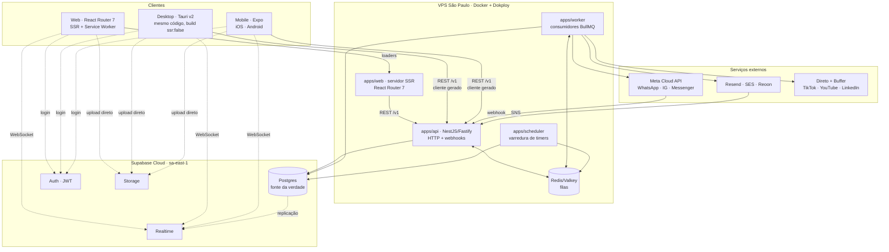
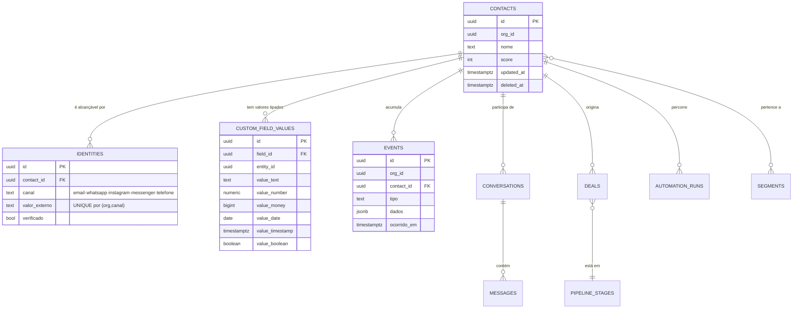
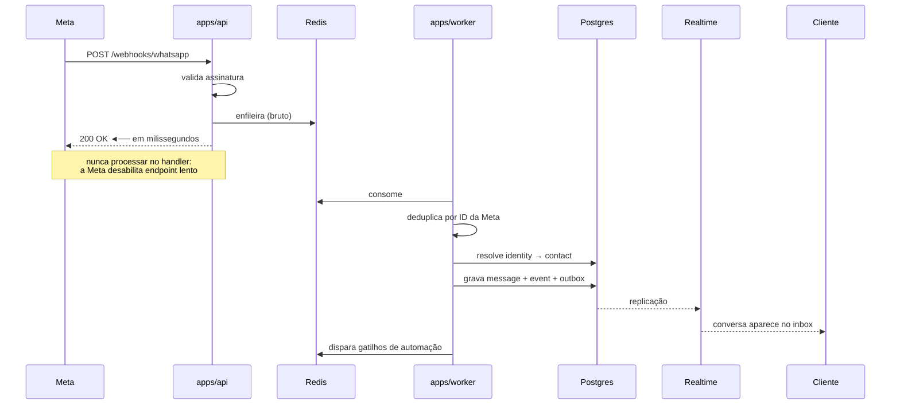
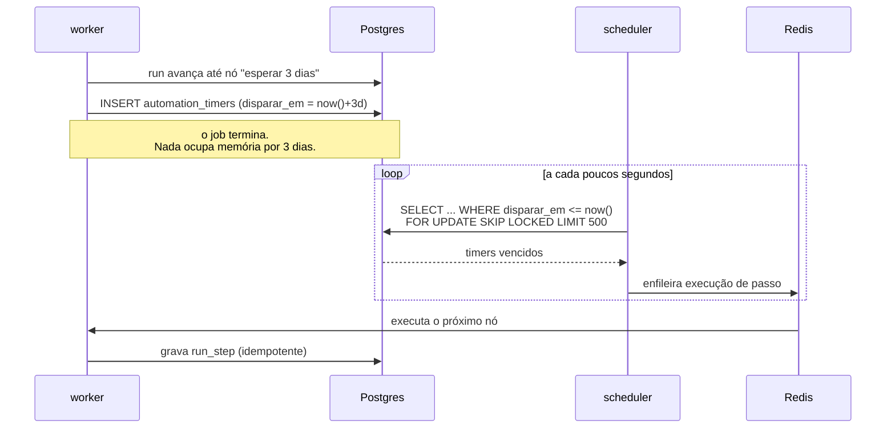

# Visão geral da arquitetura

> Decisões e justificativas estão em [`docs/adr/`](../adr/). Este documento descreve **o que existe**, não **por quê**.

## O problema que a arquitetura resolve

Pipedrive, ManyChat, Buffer e ActiveCampaign resolvem partes do mesmo ciclo de vida e não compartilham a identidade do contato. Hoje, um lead que:

1. viu um anúncio e mandou DM no Instagram → é um *subscriber* no ManyChat
2. deixou o e-mail numa isca → é um *contact* no ActiveCampaign
3. virou negociação → é um *person* no Pipedrive
4. foi impactado pelo post de terça → é uma linha de métrica agregada no Buffer

...são **quatro registros, em quatro bancos, sem chave comum**. Ninguém consegue responder "o que aconteceu com esta pessoa?" nem automatizar em cima da resposta.

O Spark é a resposta a essa pergunta. Tudo abaixo existe para sustentá-la.

---

## Topologia



**A regra que organiza tudo:** o Supabase guarda o estado, a VPS faz o trabalho.

O servidor SSR existe só para o primeiro paint do navegador; depois da hidratação, a navegação é no cliente e os dados vêm do cache. Desktop e mobile falam direto com a API — não passam pelo SSR. Os clientes falam com o Supabase apenas para autenticação, tempo real e upload; todo o resto passa pela API, onde existe um único ponto de autorização, auditoria e limite de uso.

---

## Modelo de dados — o núcleo

O modelo inteiro gira em torno de duas tabelas. Se só estas duas estiverem certas, o resto se conserta depois.



### `identities` — a peça que as quatro ferramentas não têm

Um contato é alcançável por vários endereços: um e-mail, um número de WhatsApp, um PSID do Instagram, um telefone. `identities` é a tabela que os liga a **uma** pessoa.

É ela que permite a resolução de identidade: a DM do Instagram e o e-mail preenchido no formulário convergem para o mesmo `contact_id`, e a partir daí toda automação enxerga a pessoa inteira. Sem ela, o Spark é só mais um dos quatro sistemas.

Regras:
- `UNIQUE (org_id, canal, valor_externo)` — uma identidade pertence a um contato só.
- A fusão de contatos é uma operação de primeira classe, auditada e **reversível**. Ela vai ser usada bastante, e errar uma fusão sem poder desfazer é perder dado do cliente.

### `events` — a linha do tempo

Append-only. Toda interação vira evento: mensagem recebida, e-mail aberto, negócio movido, formulário enviado, post publicado, automação executada.

- **Particionada por mês** desde a primeira migration. É a tabela que mais cresce, e reparticionar depois com dado em produção é uma operação dolorosa que ninguém quer agendar.
- Alimenta a timeline da interface, os gatilhos de automação e os relatórios.
- Retenção definida por política: dado quente em `events`, dado frio arquivado no R2 em Parquet.

---

## Módulos

Fronteiras rígidas, verificadas por lint ([ADR-0003](../adr/0003-backend-nestjs-fastify.md)). Um módulo nunca toca a tabela de outro.

| # | Módulo | Responsabilidade | Referência |
|---|---|---|---|
| 1 | `identity` | Organizações, usuários, times, papéis, permissões, auditoria | — |
| 2 | `contacts` | Contatos, **identidades**, campos custom, tags, listas, segmentos, importação, fusão, scoring, consentimento LGPD | Pipedrive + AC + ManyChat |
| 3 | `companies` | Empresas, hierarquia, contatos vinculados | Pipedrive |
| 4 | `crm` | Pipelines, estágios, negócios, atividades, metas, previsão, cotações | Pipedrive |
| 5 | `catalog` | Produtos, variantes, preços, descontos, moedas | Pipedrive |
| 6 | `channels` | WhatsApp, Instagram, Messenger, e-mail, SMS, webchat · templates · janela de 24 h | ManyChat |
| 7 | `inbox` | Conversas, atribuição, filas por time, SLA, respostas prontas, notas internas | ManyChat + Chatwoot |
| 8 | `automation` | Grafo versionado, execuções, timers, nós de gatilho/condição/espera/ação | ManyChat + AC |
| 9 | `campaigns` | E-mail, broadcast, listas, supressão, A/B, MJML, agendamento | ActiveCampaign |
| 10 | `pages` | Construtor visual, blocos, templates, domínios, publicação, A/B | AC + landing pages |
| 11 | `forms` | Captura, campos, validação, submissão, gatilho de automação | AC + ManyChat |
| 12 | `social` | Contas, calendário, fila, agendamento, publicação, métricas | Buffer |
| 13 | `events` | Timeline unificada, tracking de site e app, ingestão | — |
| 14 | `analytics` | Relatórios, dashboards, atribuição de ponta a ponta | Todos |
| 15 | `files` | Mídia, upload, CDN, biblioteca de criativos | — |
| 16 | `integrations` | Sync externo, webhooks de saída, API pública | — |

### O ciclo completo que só existe unificado

```
página publicada → formulário → identidade resolvida em contacts
   → evento na timeline → automação disparada → WhatsApp enviado
   → conversa no inbox → negócio no pipeline → produto do catálogo na cotação
```

Uma transação, um banco, uma linha do tempo. É isso que nenhuma das quatro ferramentas faz sozinha.

---|---|---|
| `identity` | Organizações, usuários, times, RBAC, sessão | — |
| `contacts` | Contatos, identidades, campos customizados, fusão, segmentos | — |
| `crm` | Pipelines, estágios, negócios, atividades, previsão | Pipedrive |
| `inbox` | Conversas, mensagens, atribuição, SLA, respostas prontas | ManyChat + Chatwoot |
| `channels` | Adaptadores de canal, webhooks, templates, janela de 24 h | ManyChat |
| `automation` | Grafo, versões, execuções, timers, interpretador | ActiveCampaign |
| `campaigns` | E-mail (Resend/SES), listas, validação (Reoon), supressão, A/B | ActiveCampaign |
| `social` | Contas, agendamento, publicação, métricas — driver direto ou Buffer | Buffer |
| `events` | Ingestão, timeline, consultas analíticas | — |
| `integrations` | Sincronização com sistemas externos, importação | — |

---

## Fluxo 1 — Mensagem recebida

O caminho mais quente do sistema. Latência percebida importa mais aqui do que em qualquer outro lugar.



Dois detalhes que não são negociáveis: responder o webhook **antes** de processar, e deduplicar por ID da Meta — reenvio é comportamento normal da plataforma, não exceção.

## Fluxo 2 — Automação com espera de dias

O mecanismo descrito em [ADR-0009](../adr/0009-motor-de-automacao.md).



`FOR UPDATE SKIP LOCKED` permite N schedulers em paralelo, sem coordenação e sem entrega dupla. Esperar custa uma linha em disco; executar custa um job de segundos.

---

## Multi-tenancy e segurança

- `org_id` em toda tabela de negócio. **RLS habilitada em todas elas** — a autorização real é da aplicação, a RLS é a rede de proteção para o bug que um dia vai acontecer.
- Tokens de terceiros (Meta, Google, LinkedIn) criptografados em repouso com `pgsodium`, nunca em texto puro.
- `audit_log` append-only: quem, o quê, em qual organização, quando, de onde.
- Logs nunca contêm conteúdo de mensagem, e-mail ou telefone — LGPD, verificado por lint.
- Exclusão lógica (`deleted_at`) nas tabelas sincronizáveis, por causa de [ADR-0012](../adr/0012-offline-first-powersync.md).
- UUID v7 como chave primária em todo lugar, desde a primeira migration.

## Decisões da Fase 1 que são caras de reverter

Estas cinco não são detalhes de implementação. Errar qualquer uma delas custa uma migração de dados em produção:

1. **UUID v7 como PK** — exigência do offline-first ([ADR-0012](../adr/0012-offline-first-powersync.md)).
2. **`events` particionada por mês** — reparticionar com volume é operação de madrugada.
3. **`identities` separada de `contacts`** — sem ela, não há resolução de identidade, e ela é a razão de o produto existir.
4. **`org_id` + RLS em toda tabela** — adicionar multi-tenancy depois é reescrever tudo.
5. **`deleted_at` em vez de `DELETE`** — sem isso, o cliente offline nunca sabe que algo sumiu.
