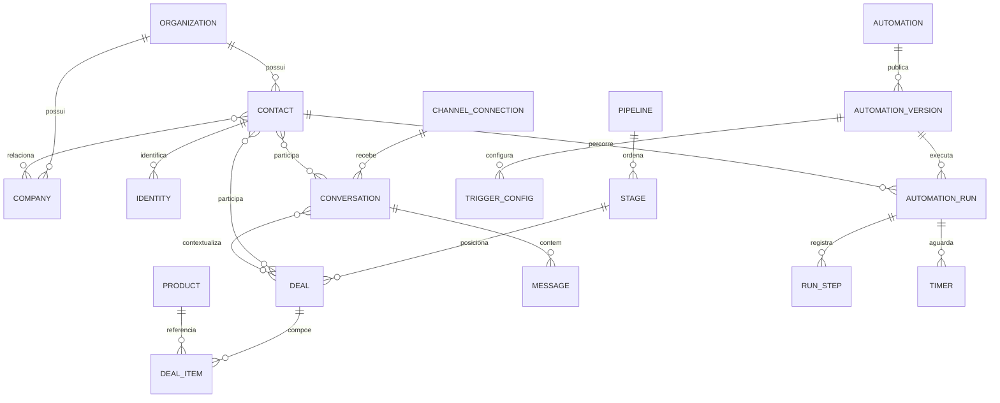

# Modelo de dados integrado

Status: modelo lógico proposto em 11/09/2026. Não é migration e não foi aplicado ao Supabase. Referência de implementação atual: `packages/db/src/schema/`. As relações abaixo devem se tornar contratos concretos por unidade de desenvolvimento.

## Invariantes existentes

Postgres é a fonte da verdade; tabelas estáticas; campos personalizados em JSONB com definições; isolamento por organização; regras em `core`; migrations versionadas; leitura de trabalho por coleções locais. Automações publicadas são imutáveis e esperas ficam em Postgres. Os ADRs 0009, 0018, 0021, 0022, 0026, 0027 e 0029 continuam sendo referência.

## Vocabulário que não pode ser ambíguo

| Termo | Significado |
| --- | --- |
| Organização / tenant | Cliente que usa o Spark; tabela atual `organizations` |
| Empresa do CRM | Empresa com a qual esse cliente negocia; propor `companies`, separada de `organizations` |
| Usuário | Pessoa autenticada que opera o Spark |
| Contato | Pessoa atendida ou relacionada a negócio; pode existir sem login |
| Identidade | Identificador do contato em um provedor/canal e seu escopo |
| Conexão | Conta Google, conta Instagram, número WhatsApp ou configuração de canal do tenant |
| Caixa de equipe | Fila de trabalho compartilhada; não é sinônimo de conexão |
| Responsável / seguidor / participante | Atribuição de trabalho / acompanhamento / pessoa envolvida, respectivamente |

## Mapa de relações proposto

O diagrama é lógico. `TRIGGER_CONFIG` representa configurações de assinatura de eventos dentro da versão, não um segundo barramento nem uma decisão de criar tabela de gatilhos independente, descartada no ADR-0027. Relações N:N exigem vínculos explícitos no modelo físico.

## Entidades e lacunas

| Domínio | Existe no schema local | Complemento proposto |
| --- | --- | --- |
| Organização e acesso | `organizations`, `users`, grupos e vínculos de permissão | Times, membros, política de acesso a caixas/conexões; decidir usuário multi-organização |
| Contatos | `contacts`, `identities` | Empresa cliente e vínculos, responsável, fusão/deduplicação, consentimento e definições de campos |
| Classificação | Tags como JSONB em contatos | Definir catálogo de tags com ID estável, renomeação/arquivamento e associação; listas/segmentos separados |
| CRM | `pipelines`, `stages`, `deals`, `activities` | Owner, seguidores, participantes, empresa, custom fields do negócio, notas/anexos e histórico de etapa |
| Catálogo | Ausente | Produtos, variantes/preços, itens de negócio, desconto/imposto e cronograma |
| Canais e inbox | Ausente | Conexões, caixas/times, conversas, participantes, mensagens, anexos, macros, atribuições e SLA |
| Automação | Apenas decisões arquiteturais | Rascunho, versões, configurações de gatilho, execuções, passos, timers e registro de efeitos |
| Eventos | `events`, particionamento previsto nas migrations | Eventos tipados e outbox transacional com entrega e deduplicação |
| Documentos | Ausente no schema inspecionado | Referência externa Google e vínculos; arquivos internos via `packages/storage` |

### Contato e identidade

Hoje a unicidade da identidade é `(org_id, channel, external_value)`. Antes de integrar canais, definir o escopo do identificador externo: provedor, conta ou aplicação podem fazer parte da identidade. Não presumir que um ID social é global ou que um telefone/e-mail não verificado basta para fundir contatos.

Propor identificador normalizado, valor de apresentação, origem e verificação. Campos `contacts.email/phone` precisam ter relação explícita com identidades: projeção do principal ou fonte canônica, evitando duas fontes divergentes. Fusão preserva histórico e trata vínculos de negócio/conversa/execução com auditoria.

### Negócio e catálogo

O negócio atual tem pipeline, etapa, contato opcional, valor, estado e previsão de fechamento. Falta moeda explícita no schema inspecionado; o contrato monetário precisa definir moeda e unidade mínima antes de atender múltiplas moedas.

Propor contato principal opcional e participantes N:N; owner singular; seguidores N:N; empresa cliente opcional. Itens de negócio guardam snapshot de descrição, preço, quantidade, desconto e imposto, para alteração do catálogo não reescrever negociação passada. Datas de cobrança, recorrência e parcelas precisam de regras próprias e exemplos aprovados.

Estados atuais: aberto, ganho e perdido, conforme contrato de domínio. Toda movimentação valida que a etapa pertence ao pipeline e que todos os vínculos pertencem ao tenant. Definir como manter ordem de cards quando houver reordenação manual e edição concorrente.

### Conversas, caixas e mensagens

Propor conexão com provedor, conta externa, capacidades, escopos concedidos, estado e referência a segredo; segredo nunca é sincronizado para o cliente. Caixa de equipe e atendente são atribuições separadas. Uma conexão pode alimentar filas diferentes segundo regras.

Conversa tem canal/conexão, participantes, estado, atendente, caixa, prioridade e datas de atividade/adiamento. Mensagem tem direção, autor, tipo (externa/nota interna), conteúdo, identificador externo, encadeamento, datas e estado de entrega. Estados propostos de entrega: pendente, enviando, aceita pelo provedor, entregue, lida e falha; nem todo canal oferece cada estado. Aceita pelo provedor não significa entregue.

Nota interna não entra na fila de envio externo. Para e-mail, modelar Para/CC/BCC, Message-ID, In-Reply-To/References, assunto, anexos e aliases; não encadear apenas pelo assunto. SMTP envia; recebimento depende de API/IMAP/encaminhamento.

Particionamento de mensagens exige decidir chave física e unicidade global dos IDs de provedor. Índice único incluindo mês não basta, sozinho, para deduplicar um evento reenviado em outro mês; especificar registro de dedupe independente quando necessário.

### Automação com várias entradas

Rascunho contém grafo, posições, configurações e coleção de gatilhos. Cada configuração possui ID estável, tipo do evento, filtro, escopo de canal/conexão e estado. Publicar congela essa configuração na versão. A ativação operacional precisa de semântica explícita: suspensão da automação impede novas entradas; cancelamento de execuções existentes é outra ação.

Execução registra versão, contato, evento de origem, ID do gatilho que iniciou, contexto e estado. Estados propostos: pronta, executando, esperando, concluída, falha e cancelada. Espera por resposta ou tempo deve ter resultado único quando resposta e timeout disputarem a mesma execução.

Passo registra nó, ocorrência da passagem pelo nó, tentativa, entrada/saída, resultado e timestamps. Separar a identidade do efeito da tentativa de transporte: uma nova tentativa não pode, por si só, autorizar novo envio. O ADR-0009 dá a direção; o contrato de falha precisa especificar o intervalo entre efeito aceito pelo provedor e confirmação local. Quando o provedor não fornece idempotência, não prometer exatamente uma entrega sem mecanismo adicional de reconciliação.

Timers precisam de reivindicação recuperável após queda do worker/scheduler. Publicação em fila usa outbox; um crash depois de reivindicar timer e antes de enfileirar não pode deixar a execução parada permanentemente. Esses detalhes precisam de testes antes de liberar automação com efeitos externos.

## Integridade, sync e permissões

- Toda referência entre entidades de negócio deve garantir mesmo tenant, por validação central e constraints apropriadas; RLS isoladamente não descreve toda integridade entre vínculos.
- Dados que sincronizam precisam de contrato de atualização/exclusão. Há entidades atuais com `archived_at`, outras com `deleted_at`, e identidades sem `updated_at`; definir semântica antes de adicioná-las às coleções.
- Índices devem partir das consultas: fila por estado/atribuição, mensagens por conversa/data, contatos por identidade, negócios por pipeline/etapa e timers vencidos.
- API pública e sync aplicam a mesma política de acesso. E-mails pessoais e documentos autorizados exigem visibilidade específica, além de pertencer ao tenant.
- Eventos de domínio descrevem entidade, ação, origem, ator, tempo, correlação e versão do payload. Mudança de negócio e outbox são gravados na mesma transação.

## Próxima unidade pronta para especificar fisicamente

Identidade + empresa cliente + vínculos do negócio. Produzir campos/tipos, nulabilidade, unicidades, FKs, índices, regras de acesso, eventos e migrations compatíveis com os dados existentes. Em seguida, especificar inbox e versão/execução de automação com os mesmos IDs e políticas. Não criar antecipadamente tabelas para todos os canais sem fechar seus contratos comuns.
